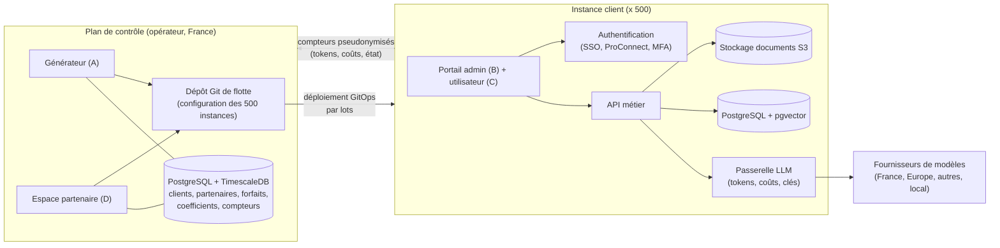

# Recommandation de stack technique — Générateur de portails IA

> **Version** : 0.1 · **Date** : 24/09/2026 · **Statut** : proposition à discuter
>
> Ce document part du cahier des charges (`docs/cahier-des-charges.md`, v0.26). Il donne une recommandation argumentée, pas une décision : les choix marqués *à valider* doivent être confirmés avec l'équipe qui développera, après un prototype.

---

## 1. Ce que la demande impose à l'architecture

Avant de choisir des outils, voici les exigences du cahier des charges qui pèsent le plus sur la technique :

| Exigence | Conséquence technique |
|---|---|
| **Une instance par client, pas de SaaS** (P-07), **500 instances** à terme | Il faut industrialiser le déploiement : un « modèle d'instance » identique, déployé et mis à jour automatiquement, par lots. Sans automatisation, 500 instances sont ingérables. |
| **Agnostique à l'hébergement** (P-02), France par défaut | Tout doit tourner sur des briques standard et open source (conteneurs, PostgreSQL, stockage compatible S3), sans service propriétaire d'un cloud. |
| **Agnostique au LLM** (P-01), coûts et tokens suivis partout (§4.5) | Un **point de passage unique** vers les modèles dans chaque instance : il route vers le bon fournisseur, compte les tokens et applique budgets et clés. |
| **Générateur central sans accès aux contenus** (P-08) | Deux mondes séparés : un **plan de contrôle** central (générateur, espace partenaire) et des **instances clients**. Seuls des compteurs pseudonymisés remontent. |
| **Configurer en parlant** (P-10) | Le « vibe coding » ne doit pas écrire du code libre. Il doit produire des **configurations déclaratives** (assistant, automatisation, formulaire…) validées par un schéma, versionnées et réversibles. |
| **Droits utilisateur / profil / équipe, délégation en cascade** (§4.4, §4.11) | Un moteur d'autorisations dédié plutôt que des règles codées en dur. |
| **RGPD, certification ISO 27001 et 42001** | Journalisation, chiffrement, gestion des secrets, traçabilité des modèles utilisés : à prévoir dès le départ. |

---

## 2. Architecture recommandée

Principes :
- Le **générateur n'appelle jamais directement une instance** pour modifier sa configuration : il écrit l'état voulu dans le **dépôt Git de flotte**, et un outil GitOps l'applique. Chaque changement (option cochée par un partenaire, nouvelle version) est donc tracé, réversible et applicable par lots, ce qui sert directement la certification ISO 27001.
- Chaque **instance est autonome** : si le plan de contrôle est indisponible, les portails continuent de fonctionner.
- Les instances **poussent** leurs compteurs vers le plan de contrôle (tokens, coûts, identifiants d'utilisateurs pseudonymisés), jamais l'inverse.

---

## 3. Stack recommandée, brique par brique

### 3.1 Langages et interfaces

| Brique | Recommandation | Pourquoi |
|---|---|---|
| Interfaces (A, B, C, D) | **TypeScript + React (Next.js)**, composants **shadcn/ui** (Radix) | Écosystème le plus large, facile à recruter ; composants accessibles, utiles pour le RGAA ; thèmes par jetons de design pour la marque blanche. |
| API des instances et services IA | **Python + FastAPI** | L'écosystème IA (RAG, agents, parsing, transcription) est d'abord en Python. |
| Plan de contrôle | **Python + FastAPI** (même langage que les instances) | Deux langages seulement dans tout le projet (TypeScript et Python) : plus simple à maintenir pour une petite équipe. |
| Widget chatbot public, bot Teams | **Web Component** autonome ; **Microsoft Bot Framework** pour Teams | Un seul script à coller sur le site du client ; Teams exige le Bot Framework. |

### 3.2 Données

| Brique | Recommandation | Pourquoi |
|---|---|---|
| Base de chaque instance | **PostgreSQL** + extension **pgvector** | Une seule base pour les données, les droits et la recherche documentaire : pas de base vectorielle séparée à opérer 500 fois. |
| Documents | Stockage **compatible S3** (celui de l'hébergeur, ou **MinIO** / **Garage** chez le client) | Standard, présent partout, y compris sur les serveurs d'un client. |
| File d'attente, cache | **Valkey** (successeur open source de Redis) | Tâches longues (ingestion, transcription), limites d'appels. |
| Plan de contrôle | **PostgreSQL + TimescaleDB** | Les KPI de consommation sont des séries temporelles ; TimescaleDB agrège vite sur 500 instances. |

### 3.3 IA

| Brique | Recommandation | Pourquoi |
|---|---|---|
| Passerelle multi-LLM | **LiteLLM** (proxy open source), une par instance | Couvre plus de cent fournisseurs ; compte tokens et coûts par clé, utilisateur et équipe ; budgets et plafonds ; clés de l'opérateur ou du client (P-01, §4.5, §4.8). C'est la brique la plus directement alignée sur votre demande. |
| Modèles hébergés en France / en Europe | **Mistral** (API) ; hébergeurs français proposant des modèles ouverts (OVHcloud AI Endpoints, Scaleway Generative APIs) | Répond à la confidentialité par usage (F-IA-10) et au RGPD. |
| Modèles locaux | **vLLM** (serveur) ou **Ollama** (petites installations) | Pour les données sensibles ou les clients qui refusent tout envoi externe. |
| Agents, automatisations, validation humaine | **LangGraph** (état persistant dans PostgreSQL, pauses pour validation humaine) *ou* **Pydantic AI** (plus simple) — *à trancher après prototype* | La validation humaine (F-VIBE-15) exige des traitements capables de s'arrêter et de reprendre. |
| MCP (Pennylane, Zoho, Notion…) | **SDK MCP officiel** (Python) côté client MCP | Standard ouvert, déjà adopté par la plupart des éditeurs. |
| Lecture des documents | **Docling** (open source), OCR de Mistral en option | Bonne qualité sur PDF, Word, tableaux ; tourne en local. |
| Transcription (comptes rendus) | **Whisper** (version faster-whisper, locale) ou modèle de transcription de Mistral via la passerelle | Au choix selon la confidentialité demandée. |
| Traces et avis sur les réponses | **Langfuse** (open source, auto-hébergé dans chaque instance) | Suivi qualité, retours utilisateurs (§4.19) ; reste dans l'instance, donc compatible RGPD. |

### 3.4 « Configurer en parlant » (vibe coding)

Recommandation la plus importante pour tenir la promesse de simplicité **sans risque** :

1. Définir un **catalogue d'objets** avec un schéma strict (JSON Schema) : assistant, automatisation, formulaire, base de connaissances, équipe, prompt, compétence, apparence.
2. Un **agent d'administration** dialogue avec le client, pose ses questions, puis produit **uniquement un objet conforme au schéma**. Il n'écrit jamais de code exécutable.
3. L'objet est validé (schéma + droits + délégation), affiché en **fiche récapitulative** (F-VIBE-08), testable, puis publié comme **nouvelle version** (F-VIBE-10).

Avantages : sécurité (rien d'arbitraire n'est exécuté), traçabilité ISO, retour arrière trivial, et la même configuration peut être présentée par plusieurs interfaces (P-04).

### 3.5 Identité et droits

| Brique | Recommandation | Pourquoi |
|---|---|---|
| Authentification | **Keycloak** (un « realm » par instance) | Code par e-mail, mot de passe + double authentification, SSO Microsoft Entra ID, Google, **ProConnect** (OIDC) ; synchronisation d'annuaires ; très répandu dans le secteur public. Alternative plus légère : **Authentik**. |
| Autorisations | **OpenFGA** (modèle de relations, inspiré de Google Zanzibar) | Exprime naturellement utilisateur / profil / équipe et la **cascade** opérateur → partenaire → sous-partenaire → client ; un seul modèle pour le générateur et les instances. Alternative : **Cerbos**. |
| Secrets et clés API | **OpenBao** (fork open source de Vault) | Stockage chiffré des clés de fournisseurs, rotation, révocation, journal (§4.15). |

### 3.6 Déploiement et exploitation de 500 instances

| Brique | Recommandation | Pourquoi |
|---|---|---|
| Exécution | **Kubernetes** : un espace isolé (namespace) par client sur des clusters mutualisés ; un cluster ou une machine dédiée pour les clients qui l'exigent | Densité suffisante pour 500 instances, isolation réseau et ressources par client. |
| Paquet d'une instance | **Chart Helm** unique, paramétré par client | Même modèle partout, y compris chez un client. |
| Mises à jour de flotte | **Argo CD** (GitOps) avec **ApplicationSets** | Mise à jour par lots, retour arrière (F-GEN-11), état de chaque instance visible (F-GEN-12). |
| Infrastructure | **OpenTofu** (fork open source de Terraform) | Décrire les clusters et l'hébergement chez chaque fournisseur. |
| Hébergement par défaut | Hébergeur français : **OVHcloud**, **Scaleway**, **Outscale** ou **Clever Cloud** ; offre **SecNumCloud** pour les collectivités ou clients qui l'exigent | Hébergement en France par défaut, cloud souverain au choix du client. |
| Supervision | **OpenTelemetry**, **Prometheus**, **Grafana**, **Loki** | Supervision technique des 500 instances (F-GEN-14). |
| Sauvegardes | **CloudNativePG** (PostgreSQL sur Kubernetes, sauvegardes continues) + sauvegarde du stockage S3 | Sauvegarde et restauration testées, exigées par l'ISO 27001. |

---

## 4. Faut-il partir d'un produit open source existant ?

Plusieurs projets couvrent déjà une partie du portail utilisateur. Mon avis :

| Projet | Intérêt | Point de vigilance |
|---|---|---|
| **LibreChat** | Chat multi-LLM, agents, MCP, licence MIT | Bonne source d'inspiration ou de composants ; son modèle d'administration ne correspond pas à votre délégation en cascade. |
| **Open WebUI** | Interface de chat très complète | Sa licence a ajouté une clause de protection de la marque : **incompatible avec la marque blanche** au-delà d'un certain nombre d'utilisateurs sans licence entreprise *(à vérifier sur la version en vigueur)*. |
| **Dify**, **Flowise** | Constructeurs d'agents et de workflows | Interfaces « à cliquer » contraires à P-10 ; licence de Dify restrictive pour un usage multi-clients et le retrait du logo *(à vérifier)*. |
| **Onyx** | Recherche documentaire d'entreprise | Couvre surtout le RAG. |

**Recommandation** : développer votre propre produit, car le générateur, la délégation en cascade, les coefficients et la création en parlant n'existent nulle part. Mais **réutiliser les briques** listées au §3 (LiteLLM, Keycloak, OpenFGA, Docling, Langfuse…), qui couvrent sans doute 60 à 70 % de la complexité technique.

---

## 5. Ordre de construction proposé

| Étape | Contenu | Pourquoi dans cet ordre |
|---|---|---|
| 1. Prototype de faisabilité (4 à 6 semaines) | Une instance : chat multi-LLM via LiteLLM, une base de connaissances, **création d'un assistant en parlant**, compteur de tokens | Valide le cœur de la promesse (P-10) avant tout le reste. |
| 2. Instance V1 | Droits (Keycloak + OpenFGA), admin client, intégrations Microsoft/Google, MCP, comptes rendus, automatisations avec validation humaine | Le produit vendable à un premier client. |
| 3. Générateur | Chart Helm, GitOps, création et mise à jour des instances, forfaits, coefficients, KPI | Nécessaire dès le 3ᵉ ou 4ᵉ client. |
| 4. Espace partenaire | Demandes de portail, options en cascade, commissions | Quand le réseau de partenaires démarre. |
| 5. Certification | Politiques ISO 27001, puis 42001, audits | Les briques choisies l'ont préparée dès l'étape 1. |

---

## 6. Points à valider

1. **Kubernetes** : il demande une compétence d'exploitation. Avez-vous (ou visez-vous) cette compétence en interne, ou chez un prestataire / hébergeur infogéré ?
2. **LangGraph ou Pydantic AI** pour les agents : à trancher sur le prototype.
3. **Keycloak par instance** ou une instance Keycloak mutualisée par cluster, avec un realm par client : question de coût et d'isolation.
4. **Licences** des projets cités au §4 : à vérifier juridiquement avant toute réutilisation.
